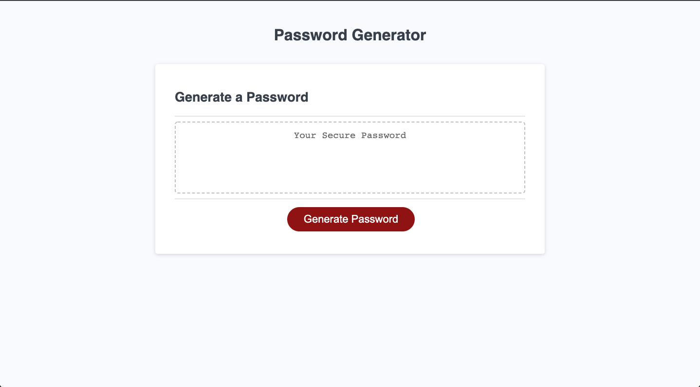
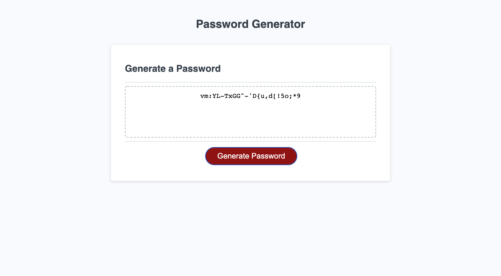

# password-generator


## Description 

The main objective of this challenge is to edit the starter code in order to create a functional randomized password generator based off of the criteria provided.
 
\
User Story
```
AS AN employee with access to sensitive data
I WANT to randomly generate a password that meets certain criteria
SO THAT I can create a strong password that provides greater security
```

\
Acceptance Criteria
```
GIVEN I need a new, secure password
WHEN I click the button to generate a password
THEN I am presented with a series of prompts for password criteria
WHEN prompted for password criteria
THEN I select which criteria to include in the password
WHEN prompted for the length of the password
THEN I choose a length of at least 8 characters and no more than 128 characters
WHEN asked for character types to include in the password
THEN I confirm whether or not to include lowercase, uppercase, numeric, and/or special characters
WHEN I answer each prompt
THEN my input should be validated and at least one character type should be selected
WHEN all prompts are answered
THEN a password is generated that matches the selected criteria
WHEN the password is generated
THEN the password is either displayed in an alert or written to the page
```

## Process

\
Edits made to JS file
```
1. Created variables for each character type 
    - (lowercase, uppercase, number, special)

2. Created functions to display prompts for user to respond to in order generate password
    - determineLength();
    - chooseLowercase();
    - chooseUppercase();
    - chooseNumbers();
    - chooseSpecial();

3. Created function to generate password using charAt method 
    - Called previous prompt functions
    - Created output variable
    - Utilized if-else statements to determine users input
```

## Screenshots



## Links
<a href="https://devinlachnicht.github.io/password-generator/" target="_blank">Deployed Application</a>
